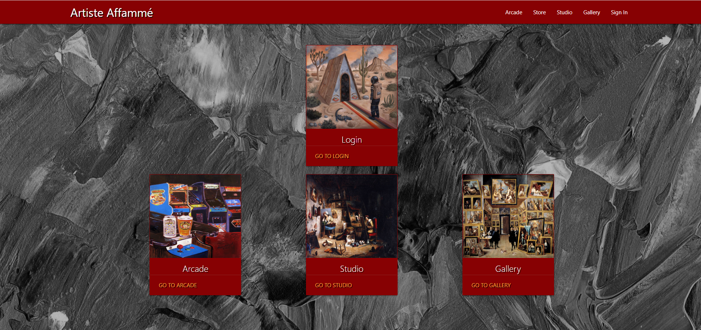
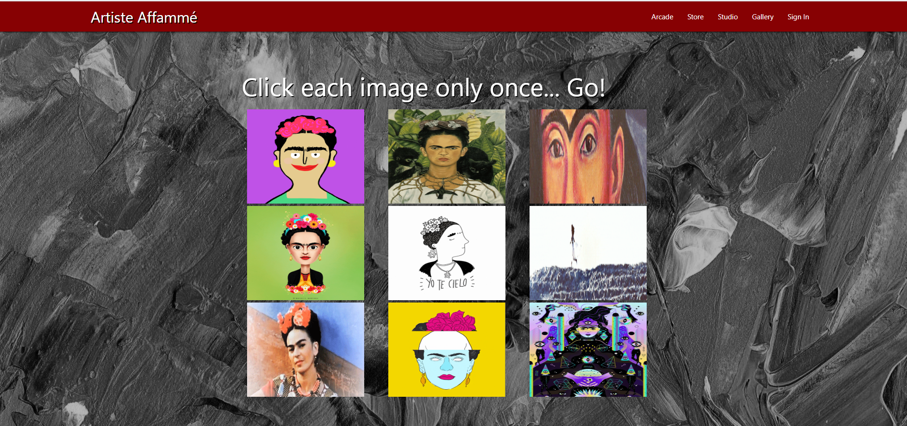
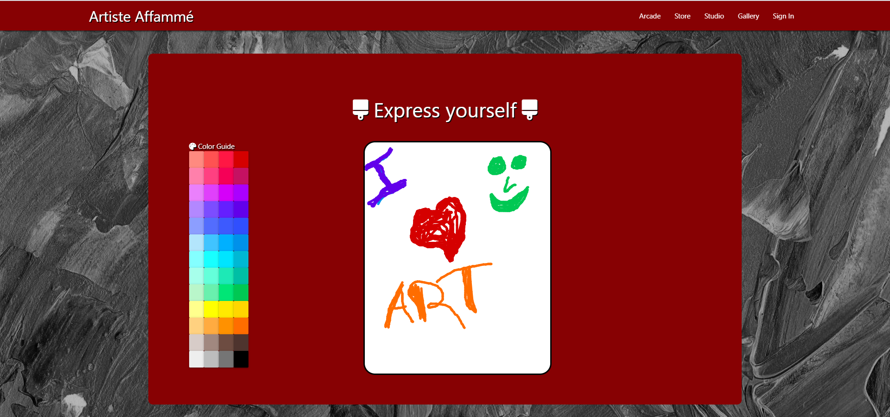

# Artiste Affame 

Immerse into the live of a renaissance artist. Play games in the arcade or test your drawing skills in the studio. Take your artist from poverty and into fame.

## Site Pictures

1. Homepage

2. Arcade

3. Studio

## Available Scripts for cloned repos

In the project directory, you can run:

### `npm start`

Runs the app in the development mode. 
Open [http://localhost:3000](http://localhost:3000) to view it in the browser.

The page will reload if you make edits. 
You will also see any lint errors in the console.

### `npm test`

Launches the test runner in the interactive watch mode. 
See the section about [running tests](https://facebook.github.io/create-react-app/docs/running-tests) for more information.

### `npm run build`

Builds the app for production to the `build` folder. 
It correctly bundles React in production mode and optimizes the build for the best performance.

## Built With

* [HTML](https://developer.mozilla.org/en-US/docs/Web/HTML)
* [CSS](https://developer.mozilla.org/en-US/docs/Web/CSS)
* [Materialize](https://materializecss.com/)
* [Javascript](https://www.javascript.com/)
* [Node.js](https://nodejs.org/en/)
* [Express](https://www.npmjs.com/package/express)
* [MongoDB](https://www.mongodb.com/)
* [Mongoose](https://mongoosejs.com/)
* [React](https://reactjs.org/)
* [html2canvas](https://html2canvas.hertzen.com/)

## Deployed Link

* [See Live Site](https://artiste-affame.herokuapp.com/)

## Authors

 * **Alexis Bounds**
    - [GitHub](https://github.com/boundsalexis) 
    - [LinkedIn](https://www.linkedin.com/in/boundsalexis/)

 * **Ian Toy**
    - [GitHub](https://github.com/ietoy)
    - [LinkedIn](https://www.linkedin.com/in/ian-toy-265077196/)

 * **Carlos Toledo**
    - [GitHub](https://github.com/kqarlos)
    - [LinkedIn](https://www.linkedin.com/in/carlos-toledo415/)

## Github Links

- [Link to site repository](https://github.com/kqarlos/election-year)
